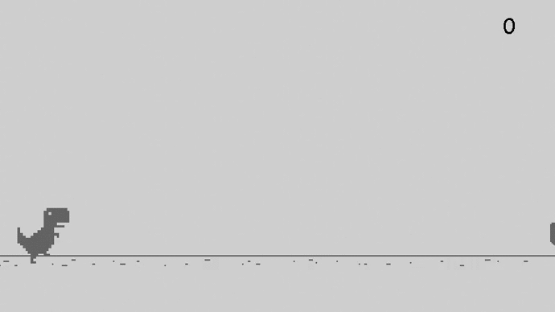

# Simple Copy of the Chrome Dino Game Using Pygame

In this project, I learned:
- The basics of Pygame
- How to use Python Packages
- How to better organize my code within objects and modules/packages
